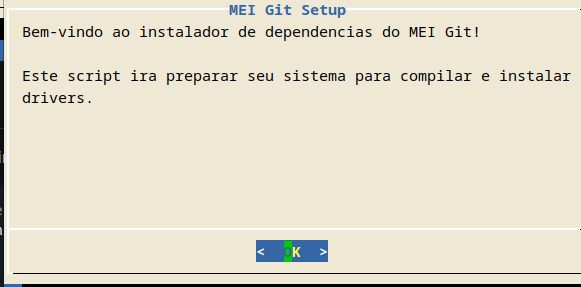
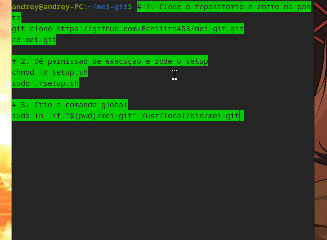

# MEI Git

<div align="center">
  <br />
  <p>
    <a href="https://github.com/Echiiiro453/mei-git"></a>
  </p>
  <br />
  <p>
    <b>O canivete suíço para instalação de drivers no Linux.</b>
  </p>
  <p>
    Detecta seu hardware e instala drivers de Wi-Fi, vídeo, rede e periféricos de forma automatizada.
  </p>
  <p>
    <a href="#">
      
    </a>
    <a href="#">
      
    </a>
    <a href="#">
      
    </a>
  </p>
</div>

---

> Cansado de passar horas em fóruns obscuros procurando drivers compatíveis com Linux?  
> O **MEI Git** automatiza todo o processo de detecção, download e instalação, usando um banco de dados curado com soluções para os hardwares mais comuns e problemáticos.

---

## 🚀 Funcionalidades

- 🔍 **Detecção Automática:** Identifica seu hardware (`lspci`, `lsusb`) e IDs de fabricante/dispositivo.  
- 📂 **Banco de Dados Inteligente:** Usa `drivers.json` com “receitas” de instalação para cada hardware.  
- ⚙️ **Múltiplos Métodos:** Suporte a instalação via `git clone` + compilação, gerenciadores de pacotes (`apt`, `dnf`, etc.) ou scripts `shell`.  
- 🌍 **Ampla Cobertura:** Inclui drivers para:
  - 📡 Wi-Fi & Ethernet (Realtek, Broadcom)  
  - 🎮 Placas de Vídeo (NVIDIA legacy)  
  - 🖨️ Impressoras (HP e outras)  
  - 🔌 E muito mais...  

---

## 🎥 Demonstração



## 📥 Instalação

A instalação é feita em dois passos simples: rodar o script de setup e criar o comando global.

```bash
# 1. Clone o repositório e entre na pasta
git clone https://github.com/Echiiiro453/mei-git.git
cd mei-git

# 2. Dê permissão de execução e rode o setup
chmod +x setup.sh
sudo ./setup.sh

# 3. Crie o comando global
sudo ln -sf "$(pwd)/mei-git" /usr/local/bin/mei-git
```

Pronto! Agora o comando `mei-git` está disponível em todo o sistema.  

---

## 💻 Como Usar

Fluxo de trabalho simples: **primeiro escaneie o hardware, depois instale o que precisar**.

### 1. Escanear Hardware
```bash
mei-git scan
```
Mostra o que o MEI Git detecta e quais drivers são compatíveis.  

### 2. Instalar um Driver
```bash
# Wi-Fi
sudo mei-git install wifi

# Vídeo
sudo mei-git install video

# Rede Ethernet
sudo mei-git install ethernet
```
Se um driver compatível for encontrado, a instalação começará automaticamente.

---

## 📂 Estrutura do Projeto

```
mei-git/
├── mei_git      # Script principal (CLI)
├── drivers.json    # Banco de dados com receitas de instalação
├── setup.sh        # Script para instalar dependências
└── README.md       # Esta documentação
```

---

## 🛠️ Roadmap (Planos Futuros)

- [ ] Suporte a mais distribuições no script de setup (Void, Alpine, etc.)  
- [ ] Detecção e instalação de drivers AMD  
- [ ] Suporte a drivers proprietários Canon/Epson  
- [ ] Criar interface gráfica (GUI) simples  

---

## 🤝 Contribuindo

Contribuições são muito bem-vindas!  

1. Faça um fork do projeto  
2. Crie uma branch (`git checkout -b feature/NomeDaFeature`)  
3. Commit (`git commit -m 'feat: Adiciona suporte para o driver X'`)  
4. Push (`git push origin feature/NomeDaFeature`)  
5. Abra um Pull Request  

---

## 📜 Licença

Distribuído sob a licença MIT. Veja o arquivo [LICENSE](LICENSE) para mais detalhes.  

---

<div align="center">
  <h3>⭐ Se este projeto te ajudou, considere dar uma estrela no repositório!</h3>
</div>
